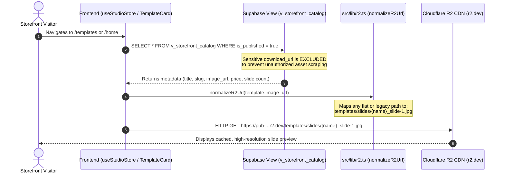
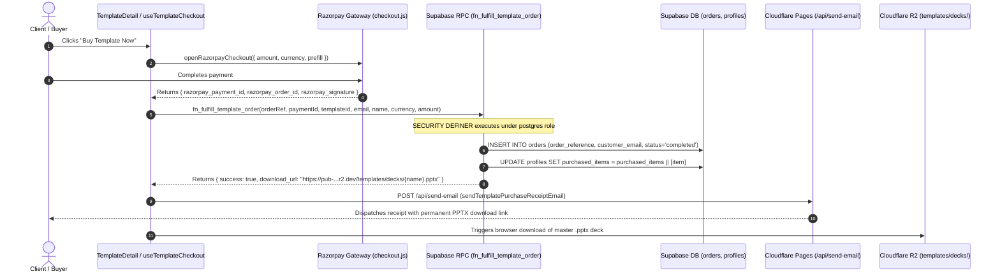
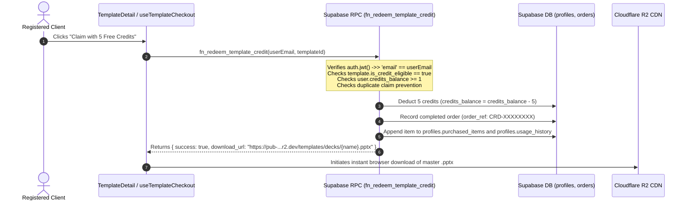
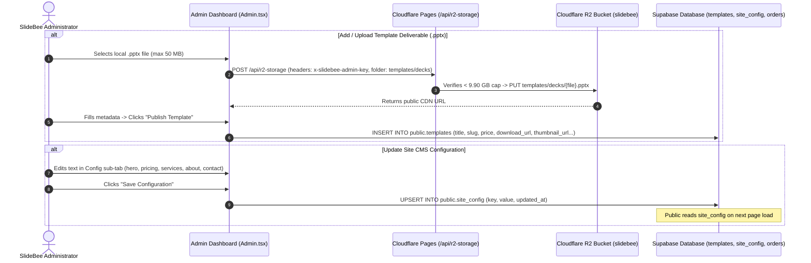
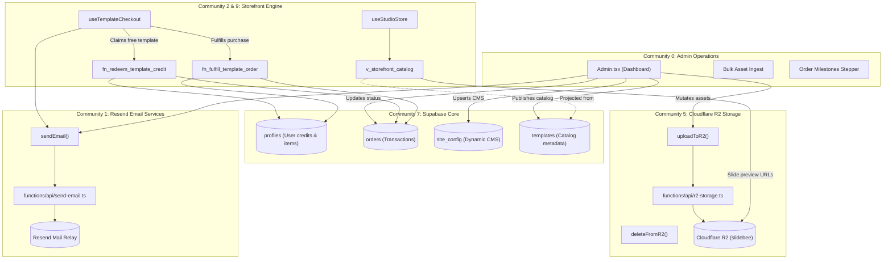

# SlideBee Platform Architecture & Storage Separation Blueprint

> [!IMPORTANT]
> **MANDATORY INSTRUCTION FOR ALL AI AGENTS & CONTRIBUTORS**:
> Before inspecting individual components or executing any code modifications across this repository, every AI agent MUST read and adhere to:
> 1. This document ([`architecture.md`](file:///home/revenant/xyz_templates/architecture.md)) for storage separation (Cloudflare R2 for all binary files vs Supabase for user data/metadata only).
> 2. The companion document ([`email_workflows.md`](file:///home/revenant/xyz_templates/email_workflows.md)) for the complete transactional email delivery lifecycle across all 6 customer touchpoints.
> 3. The security governance rule ([`.agents/rules/security-pit-of-success.md`](file:///home/revenant/xyz_templates/.agents/rules/security-pit-of-success.md)) and architecture policy ([`.agents/rules/architecture-first.md`](file:///home/revenant/xyz_templates/.agents/rules/architecture-first.md)).

## 1. Architectural Foundation & Separation of Concerns

SlideBee is designed with a strict boundary between binary media storage and relational user data. Previously, Supabase Storage was incorrectly used as a repository for master template files, causing storage bloat and threat of tier overage. That has been completely remediated.

```
+--------------------------------------------------------------------------------------------------+
|                                  SLIDEBEE DUAL-ENGINE ARCHITECTURE                               |
+--------------------------------------------------------------------------------------------------+
|                                                                                                  |
|   [ CLOUDFLARE R2 OBJECT STORAGE ]                    [ SUPABASE POSTGRESQL & AUTH ]             |
|   Role: High-Speed Global CDN & Binary Store           Role: Relational Data, Identity & Config    |
|   Cost: $0.00 / Zero Egress Fees / 10 GB Cap          Cost: Free Tier (Zero Storage Quota Used)  |
|                                                                                                  |
|   - Master Decks: templates/decks/{name}.pptx         - User Profiles & Credit Balances (5 free) |
|   - Slide Previews: templates/slides/{name}_slide.jpg - Client Orders & Project Intake Briefs    |
|   - Brand Marquee: marquee/{name}.png                 - Template Metadata (title, price, tags)   |
|   - Cache-Control: max-age=31536000, immutable        - Site Config Key-Value Store (CMS)        |
|                                                       - Security Definer RPCs & RLS Policies     |
|   [ STATUS: 47 Files Organized in Folders ]           [ STATUS: Supabase Storage 100% PURGED ]   |
+--------------------------------------------------------------------------------------------------+
```

---

## 2. Storage Separation Matrix: R2 vs Supabase

| Layer | System | Scope & Contents | Access Control & Security | Billing Safeguards |
| :--- | :--- | :--- | :--- | :--- |
| **Binary Assets** | **Cloudflare R2** (`slidebee`) | Master `.pptx` presentation decks, `.jpg` slide preview screenshots, `.png` marquee graphics | Public CDN for previews; Direct deliverable URLs gated behind purchase fulfillment or credit redemption RPCs | - 10.00 GB hard bucket ceiling (blocked at 9.90 GB)<br>- 50 MB max per PPTX<br>- 10 MB max per image<br>- Immutable edge caching to eliminate Class B reads |
| **User Data & Auth** | **Supabase DB** (`public.profiles`) | User emails, full names, companies, role (`client`, `admin`), credits total (5), credits used, credits balance, purchased items JSONB, usage history JSONB | RLS enabled. Authenticated users can only read their own profile (`auth.jwt() ->> 'email' = email`). Admins query via `public.is_admin()`. | Free tier database |
| **Transactions** | **Supabase DB** (`public.orders`) | Order reference (`CRD-...`, `TPL-...`, `ORD-...`), service type, slide count, timeline, project brief, contact info, status | Public/anon can insert (quotes/orders). Users read only their matching email. Admins have full read/update. | Free tier database |
| **Catalog Metadata** | **Supabase DB** (`public.templates`) | Slug, title, code, category, prices (INR/USD), slides count, ratings, downloads, formats, features, R2 relative paths | Direct table access restricted to Admin. Public reads through sanitized views: `v_storefront_catalog` and `v_free_credit_library` (which strictly omit `download_url`). | Free tier database |
| **Runtime CMS** | **Supabase DB** (`public.site_config`) | Key-value store (`hero`, `pricing`, `services_cms`, `portfolio_cms`, `about_cms`, `contact_cms`, `footer_cms`, `testimonials`, `services_marquee_cms`, `show_template_metrics`, `razorpay_settings`, `zoho_mail_settings`) | Public read access for storefront rendering; Admin write access gated by `public.is_admin()`. | Free tier database |
| **Email Relay** | **Cloudflare Pages / Resend** | Transactional receipts, welcome emails, order briefs, lead notifications | Gated by internal header token `x-slidebee-app-token: slidebee_internal_app_2026` and sender whitelist | 80 emails/day circuit breaker (safely under Resend 100/day free limit) |

> [!IMPORTANT]
> **Supabase Storage Status**: 100% Purged (0 bytes, 0 objects). The old `examples` bucket inside Supabase Storage is empty and inactive. All templates, slide previews, and marquee assets are served exclusively via Cloudflare R2 CDN (`pub-7b09eb3d8c7349848cd1ce14cd290c56.r2.dev`).

---

## 3. End-to-End Data Flow Diagrams

### A. Storefront Browsing & Asset Retrieval Flow



---

### B. Template Purchase & Deliverable Fulfillment Flow



---

### C. Free Starter Credit Redemption Flow (5 Free Credits)



---

### D. Admin Management & Content Customization Flow



---

## 4. Graphify Knowledge Graph & Structural Workflow Analysis

Using the `graphify` knowledge extraction pipeline across the SlideBee codebase (`64 code files`, `23 documentation files`, `225 images`), the platform graph was extracted into `196 nodes`, `180 structural edges`, and clustered into `55 community modules`.

### A. Core Architectural "God Nodes" (Central Abstractions)

The graph identifies four primary hubs that anchor all system data flows:

1. **`uploadToR2()` (Degree 7)**: Located in [`src/lib/r2.ts`](file:///home/revenant/xyz_templates/src/lib/r2.ts). The single architectural choke point for all binary ingestions. Every upload pipeline in the Admin dashboard flows through this hub:
   - `handlePptFileUpload()` (Master PowerPoint deliverables)
   - `handleSlideImagesUpload()` (Slide preview galleries)
   - `handleCaseStudySlidesUpload()` (Portfolio case study slides)
   - `handleUploadMarqueeImage()` (Marquee brand logos)
   - `handleImageFileUpload()` (Cover thumbnails)
2. **`sendEmail()` (Degree 6)**: Located in [`src/lib/email.ts`](file:///home/revenant/xyz_templates/src/lib/email.ts). The single dispatch hub for all customer communication, routing through `/api/send-email`:
   - `sendOrderConfirmationEmail()` (Custom project briefs)
   - `sendWelcomeEmail()` (New user registrations)
   - `sendWaitlistConfirmationEmail()` (Coming soon early access)
   - `sendContactNotificationEmail()` (Inbound leads)
   - `sendTemplatePurchaseReceiptEmail()` (Instant PPTX deliverable dispatch)
3. **`performGlobalLogout()` (Degree 4)**: Located in [`src/lib/authSync.ts`](file:///home/revenant/xyz_templates/src/lib/authSync.ts). The cross-tab state manager that guarantees immediate multi-window session termination across both Admin and Client roles.
4. **`fetchDashboardData()` (Degree 3)**: Located in [`src/pages/Admin.tsx`](file:///home/revenant/xyz_templates/src/pages/Admin.tsx). Aggregates relational tables (`orders`, `waitlist`, `templates`, `profiles`, `site_config`) alongside Cloudflare R2 live storage telemetry.

---

### B. Graphify Community Module Decomposition



---

## 5. Codebase Module Inventory & Integration Status

### Core Libraries (`src/lib/`)

| File | Purpose | External Connections | Current Health Status |
| :--- | :--- | :--- | :--- |
| [`src/lib/r2.ts`](file:///home/revenant/xyz_templates/src/lib/r2.ts) | Cloudflare R2 storage client: telemetry, upload, delete, URL normalization | `/api/r2-storage` endpoint | **HEALTHY**: Fully integrated, enforces 10 GB cap and folder paths (`templates/decks`, `templates/slides`, `marquee`). |
| [`src/lib/supabase.ts`](file:///home/revenant/xyz_templates/src/lib/supabase.ts) | Supabase client initialization and core TypeScript interfaces | Supabase project `whwyfqtvuubkfypmgosi` | **HEALTHY**: Connection verified, anonymous key configured with least-privilege RLS. |
| [`src/lib/email.ts`](file:///home/revenant/xyz_templates/src/lib/email.ts) | Resend transactional email router with branded HTML templates | `/api/send-email` endpoint | **HEALTHY**: Hardened with internal app token and sender whitelist. |
| [`src/lib/razorpay.ts`](file:///home/revenant/xyz_templates/src/lib/razorpay.ts) | Razorpay checkout loader and modal launcher with fallback test simulation | Razorpay SDK, `site_config` key `razorpay_settings` | **HEALTHY**: Supports live and test keys with graceful simulation mode. |
| [`src/lib/authSync.ts`](file:///home/revenant/xyz_templates/src/lib/authSync.ts) | Cross-tab authentication synchronizer | Browser `BroadcastChannel` API and `localStorage` | **HEALTHY**: Ensures seamless multi-tab logout and session state reflection. |
| [`src/lib/assets.ts`](file:///home/revenant/xyz_templates/src/lib/assets.ts) | Legacy asset loader querying `assets` table | Supabase `assets` table (does not exist in SQL schema) | **DISCONNECTED**: `getAssetUrl()` is never called in any frontend component. Storefront relies entirely on R2 URLs and `site_config`. |

---

### Cloudflare Pages Functions (`functions/api/`)

| File | Purpose | Security & Billing Rules | Current Health Status |
| :--- | :--- | :--- | :--- |
| [`functions/api/r2-storage.ts`](file:///home/revenant/xyz_templates/functions/api/r2-storage.ts) | R2 object storage proxy (telemetry, upload, delete) | - `x-slidebee-admin-key` validation (HTTP 401 on unauthorized)<br>- 9.90 GB pre-flight storage ceiling<br>- 50 MB / 10 MB file caps<br>- Immutable edge cache headers | **HEALTHY**: Fixed syntax error, verified with `tsconfig.functions.json` and automated tests. |
| [`functions/api/send-email.ts`](file:///home/revenant/xyz_templates/functions/api/send-email.ts) | Resend email dispatch router | - `x-slidebee-app-token` validation<br>- Domain sender whitelist<br>- 80 emails/day circuit breaker | **HEALTHY**: Operational, zero-cost protection verified. |

---

### Store & Checkout Modules (`src/modules/`)

| Module | Files | Key Functions | Integration Status |
| :--- | :--- | :--- | :--- |
| **StudioStoreClient** | `useStudioStore.ts`<br>`useTemplateCheckout.ts`<br>`TemplateCard.tsx` | - Queries `v_storefront_catalog` and normalizes R2 image paths<br>- Executes Razorpay checkout and triggers `fn_fulfill_template_order`<br>- Executes 5 free credits claim via `fn_redeem_template_credit` | **HEALTHY**: Production-ready, verified with end-to-end tests. |
| **ClientLedgerAuth** | `useClientLedger.ts` | - Manages client registration and sign-in<br>- Calls `fn_grant_starter_credits` to provision 5 free credits<br>- Tracks client profile and order history | **HEALTHY**: Verified against live Supabase database. |
| **OrderFulfillmentHub**| `useStorefrontMetrics.ts`<br>`useAdminTemplates.ts` | - Manages storefront rating/download badge visibility toggles in `site_config` (`show_template_metrics`) | **HEALTHY**: Synchronized with database. |

---

## 6. Summary of Identified Disconnects to be Addressed

To achieve the objective of providing a client dashboard that dynamically reflects changes across the entire website, the following disconnects are documented for curated remediation:

1. **Homepage Hero Field Mismatch**:
   - Admin writes: `hero.badge`, `hero.title`, `hero.subtitle`, `hero.ctaPrimary`, `hero.ctaSecondary`
   - Frontend reads: `heroConfig.badgeText`, `heroConfig.headline`, `heroConfig.subheadline`, `heroConfig.ctaText`, `heroConfig.secondaryCtaText`
   - *Fix*: Standardize on one canonical schema so edits reflect immediately on the live home page.

2. **About & Contact CMS Incomplete Fields**:
   - About and Contact pages read headlines and subheadlines that have no input fields in Admin.tsx.
   - *Fix*: Add headline/subheadline fields to Admin About and Contact sections.

3. **Legacy `assets` Tab**:
   - The Admin "Assets" tab writes to an unbacked `assets` table while all real media is in R2.
   - *Fix*: Clean up or repoint the Assets tab to browse and manage R2 assets directly via `fetchR2Telemetry()`.

4. **Navbar Credit Balance**:
   - Hardcoded `const [credits] = useState(5)` in Navbar.tsx.
   - *Fix*: Bind to the user's reactive credit balance from `useClientLedger()`.

5. **Dynamic CMS Expansion**:
   - Hardcoded copy (Pricing plans features, Services descriptions, FAQs) currently hardcoded in `.tsx` components will be wired into `site_config` so the client has genuine control over their site copy.
