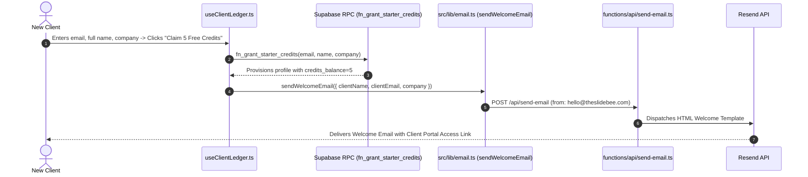
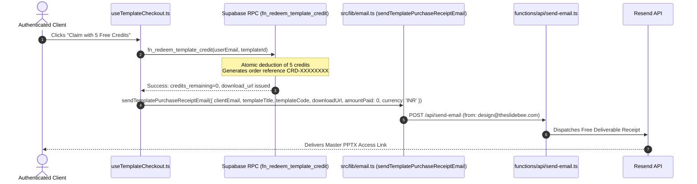
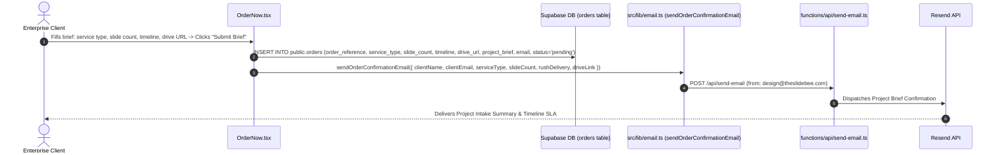
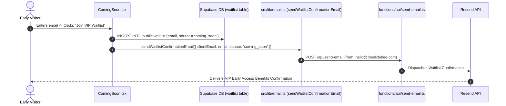
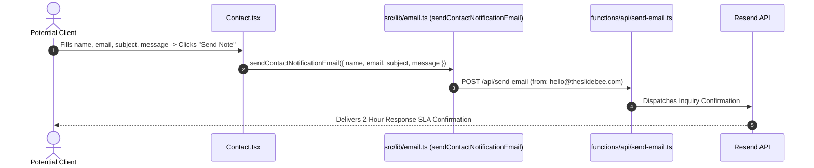

# SlideBee Transactional Email Dispatch Architecture & Lifecycle Workflows

## 1. Executive Summary & Core Infrastructure

The SlideBee email delivery engine is powered by **Resend** and mediated through a secure, authenticated serverless edge router located at [`functions/api/send-email.ts`](file:///home/revenant/xyz_templates/functions/api/send-email.ts) (with a local development proxy in [`vite.config.ts`](file:///home/revenant/xyz_templates/vite.config.ts)).

All client-facing email helper functions reside in [`src/lib/email.ts`](file:///home/revenant/xyz_templates/src/lib/email.ts).

```
+--------------------------------------------------------------------------------------------------+
|                                SLIDEBEE EMAIL DISPATCH INFRASTRUCTURE                            |
+--------------------------------------------------------------------------------------------------+
|                                                                                                  |
|   [ CLIENT TRIGGER ]                   [ SECURITY & DISPATCH ROUTER ]       [ RESEND RELAY ]     |
|                                                                                                  |
|   1. New Registration     -----\                                                                 |
|   2. Template Purchase     -----\                                                                |
|   3. Credit Redemption     -----\   POST /api/send-email                    api.resend.com/emails|
|   4. Custom Project Brief   ----->  Header: x-slidebee-app-token       ---> Status: 200 OK       |
|   5. VIP Waitlist Signup   -----/   Whitelist: *.theslidebee.com            Fallback: Resend Dev |
|   6. Contact Lead Inbound -----/    Rate Limit: 80/day Circuit Breaker                           |
|                                                                                                  |
+--------------------------------------------------------------------------------------------------+
```

---

## 2. Security Invariants & Zero-Cost Billing Guardrails

### 2.1 Authentication & Anti-Relay Defense (TOB-SB-07)
- **Token Verification**: Every request to `/api/send-email` must pass the application header:
  `x-slidebee-app-token: slidebee_internal_app_2026`
  or an authorized administrator secret (`x-slidebee-admin-key`).
- **Rejection**: Requests without valid authentication tokens are rejected immediately with **HTTP 401 Unauthorized**.

### 2.2 Sender Whitelisting
To prevent spoofing or open relay abuse, only authorized SlideBee domain senders are permitted:
- `hello@theslidebee.com` (Official Inquiries & Welcome)
- `design@theslidebee.com` (Deliverables & Studio Direction)
- `admin@theslidebee.com` (System Administration)
- `support@theslidebee.com` (Customer Support)
- `notifications@theslidebee.com` (System Alerts)
- `onboarding@resend.dev` (Verified Resend Sandbox Fallback)

Unapproved sender addresses are rejected with **HTTP 403 Forbidden**.

### 2.3 Resend Zero-Cost Circuit Breaker (80 Emails / Day)
- **Daily Quota Ceiling**: The free tier of Resend provides 100 emails/day. SlideBee enforces a hard stop at **80 emails/day** to ensure an absolute $0.00 zero-cost billing invariant.
- **Enforcement**: Once `dailyEmailCount >= 80` for the current UTC calendar day, all subsequent dispatch attempts are rejected with **HTTP 429 Too Many Requests**:
  `"Zero-Cost Safety Cap: Daily email limit of 80 reached for YYYY-MM-DD. Request blocked to guarantee $0.00 zero billing."`
- **Automatic Reset**: The counter resets automatically at `00:00:00 UTC`.

### 2.4 Resend Domain Fallback Protocol
If the custom domain `theslidebee.com` is pending DNS propagation or encounters an unverified domain error on Resend:
1. The router intercepts the HTTP error.
2. It automatically retries the dispatch using the verified fallback sender: `SlideBee Studio <onboarding@resend.dev>`.
3. It sets `reply_to` to `hello@theslidebee.com` or `design@theslidebee.com` so client responses always route back to the official studio team.

---

## 3. End-to-End Email Lifecycle Workflows

---

### Workflow 1: New Client Registration & 5 Starter Credits Grant

Triggered immediately when a client creates an account or signs up via [`src/modules/ClientLedgerAuth/useClientLedger.ts`](file:///home/revenant/xyz_templates/src/modules/ClientLedgerAuth/useClientLedger.ts) (`handleRegister`).



* **Sender**: `SlideBee Studio <hello@theslidebee.com>`
* **Recipient**: Client's verified email address
* **Subject**: `Welcome to SlideBee Studio — Your Client Account is Ready`
* **Content Payload**:
  * Formal welcome confirming active client membership.
  * Confirmation that 5 Free Starter Design Credits have been deposited.
  * Deep link button to access the Client Portal (`https://theslidebee.com/#/account`).
  * Feature summary: 1-click brief submissions, live presentation draft tracking, and credit ledger monitoring.

---

### Workflow 2: Template Purchase & Deliverable Receipt (Paid Orders)

Triggered immediately upon successful completion of Razorpay payment checkout in [`src/modules/StudioStoreClient/useTemplateCheckout.ts`](file:///home/revenant/xyz_templates/src/modules/StudioStoreClient/useTemplateCheckout.ts) (`executeRazorpayCheckout`).

```mermaid
sequenceDiagram
    autonumber
    actor Client as Purchasing Client
    participant Checkout as useTemplateCheckout.ts
    participant RZP as Razorpay Gateway
    participant RPC as Supabase RPC (fn_fulfill_template_order)
    participant Email as src/lib/email.ts (sendTemplatePurchaseReceiptEmail)
    participant Router as functions/api/send-email.ts
    participant Resend as Resend API

    Client->>Checkout: Clicks "Buy Template Now" (e.g. 499 INR / $9 USD)
    Checkout->>RZP: openRazorpayCheckout(...)
    Client->>RZP: Completes transaction
    RZP-->>Checkout: Returns payment_id, order_id, signature
    Checkout->>RPC: fn_fulfill_template_order(orderRef, paymentId, templateId, email, name, currency, amount)
    RPC-->>Checkout: Order completed; returns permanent download_url
    Checkout->>Email: sendTemplatePurchaseReceiptEmail({ clientEmail, templateTitle, templateCode, downloadUrl, amountPaid, currency })
    Email->>Router: POST /api/send-email (from: design@theslidebee.com)
    Router->>Resend: Dispatches Delivery Email
    Resend-->>Client: Delivers Receipt with Permanent Master PPTX Download Link
```

* **Sender**: `SlideBee Design Studio <design@theslidebee.com>`
* **Recipient**: Client's email
* **Subject**: `Your Master Presentation Files: {Template Title} ({Template Code}) — SlideBee`
* **Content Payload**:
  * Item purchased (e.g., *Accenture Enterprise Strategy Suite*).
  * Unique template code (e.g., `SB-ACC01`).
  * Payment receipt confirmation with amount paid in INR or USD.
  * Commercial license grant (Single Commercial Unlimited Use).
  * Prominent Gold Action Button: **"Download Master Presentation (.pptx)"** pointing directly to Cloudflare R2 CDN (`https://pub-...r2.dev/templates/decks/{name}.pptx`).

---

### Workflow 3: Starter Credit Redemption Deliverable (Free Orders)

Triggered when a logged-in client redeems their 5 starter credits for an eligible template via [`src/modules/StudioStoreClient/useTemplateCheckout.ts`](file:///home/revenant/xyz_templates/src/modules/StudioStoreClient/useTemplateCheckout.ts) (`handleRedeemWithCredits`).



* **Sender**: `SlideBee Design Studio <design@theslidebee.com>`
* **Recipient**: Client's email
* **Subject**: `Your Master Presentation Files: {Template Title} ({Template Code}) — SlideBee`
* **Content Payload**:
  * Dispatches the master PowerPoint deliverable link.
  * Amount listed as ₹0 (Redeemed via 5 Free Starter Design Credits).
  * Browser automatically triggers file download simultaneously.

---

### Workflow 4: Custom Presentation Project Intake Confirmation

Triggered when a client submits a custom presentation brief at `/ordernow` via [`src/pages/OrderNow.tsx`](file:///home/revenant/xyz_templates/src/pages/OrderNow.tsx) (`handleSubmit`).



* **Sender**: `SlideBee Design Studio <design@theslidebee.com>`
* **Recipient**: Client's email
* **Subject**: `Brief Received: {Service Tier} ({Slide Count} Slides) — SlideBee Studio`
* **Content Payload**:
  * Confirmation that senior art directors have received the requirements.
  * Summary card: Service Tier, Slide Count, Turnaround Priority (24h Rush vs Standard 48h).
  * Verified hyperlink to uploaded Google Drive/Dropbox design assets.
  * What happens next timeline:
    1. Slide count and brand assets verified.
    2. 2-slide design direction sample delivered within 4–6 hours.
    3. Full deck execution with revision rounds upon style approval.
  * Mutual NDA confidentiality assurance.

---

### Workflow 5: VIP Waitlist Early Access Reservation

Triggered when an early visitor registers on the Coming Soon page (`/coming-soon`) via [`src/pages/ComingSoon.tsx`](file:///home/revenant/xyz_templates/src/pages/ComingSoon.tsx) (`handleSubmit`).



* **Sender**: `SlideBee Studio <hello@theslidebee.com>`
* **Recipient**: Visitor's email
* **Subject**: `VIP Access Confirmed: You're on the SlideBee Waitlist`
* **Content Payload**:
  * Welcome to the exclusive reservation list.
  * Reserved benefits:
    1. 30% discount on first custom presentation project.
    2. Free starter master deck instant download access at launch.
    3. Priority turnaround queue access.

---

### Workflow 6: Inbound Client Inquiry / Contact Lead Notification

Triggered when a prospect sends a message on `/contact` via [`src/pages/Contact.tsx`](file:///home/revenant/xyz_templates/src/pages/Contact.tsx) (`handleSubmit`).



* **Sender**: `SlideBee Studio <hello@theslidebee.com>`
* **Recipient**: Prospect's email
* **Subject**: `We Received Your Note: {Subject} — SlideBee Studio`
* **Content Payload**:
  * Confirmation of receipt.
  * Studio SLA: 2-hour response time guarantee.
  * Copy of the submitted note and subject for client reference.

---

## 4. Verification Checklist & Testing

All email workflows are covered by automated assertions in [`tests/e2e_workflows.test.ts`](file:///home/revenant/xyz_templates/tests/e2e_workflows.test.ts):

| Assertion | Target Function / Router | Invariant Tested | Verification Command |
| :--- | :--- | :--- | :--- |
| **Workflow 3** | `sendWelcomeEmail` | Payload structure, 5 credits notice, correct sender | `npx tsx tests/e2e_workflows.test.ts` (Pass) |
| **Workflow 4** | `sendOrderConfirmationEmail` | Project intake brief, SLA, formats | `npx tsx tests/e2e_workflows.test.ts` (Pass) |
| **Workflow 6** | `sendTemplatePurchaseReceiptEmail` | Deliverable link, payment receipt, license | `npx tsx tests/e2e_workflows.test.ts` (Pass) |
| **Workflow 18** | `functions/api/send-email.ts` | TOB-SB-07: Unauthenticated request returns HTTP 401 | `npx tsx tests/e2e_workflows.test.ts` (Pass) |
| **Workflow 18** | `functions/api/send-email.ts` | 80 emails/day circuit breaker zero-cost ceiling | `npx tsx tests/e2e_workflows.test.ts` (Pass) |
